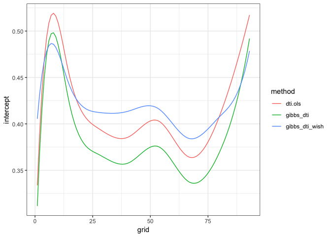
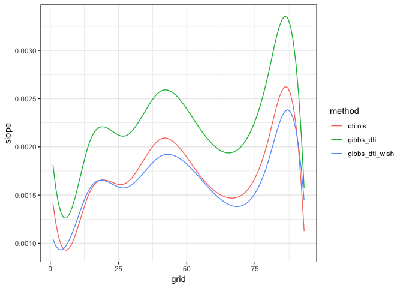

## tidyfunfun

### FDA Functions for tf-Class

## Installation

``` r
# install.packages("devtools")
devtools::install_github('gekim0519/tidyfunfun')
```

## Introduction

**`tidyfun`** is geared toward making functional data analysis (FDA)
easy, especially for data wrangling and exploratory analysis.

Look [here](https://fabian-s.github.io/tidyfun/) for an introduction on
**`tidyfun`** with examples.

Further examples on data wrangling and plotting with **`tfd`** class on
this github page can be found in the data preparation folder
[here](https://github.com/gekim0519/tidyfun_fpca/blob/master/data_preparation/preparation.md).

## Objective

  - The role of this project is to extend functions for FDA in
    **`tidyfun`**. Specfically, four functions were made for conducting
    **fpca** and **function-on-scalar regression** on **`tfd`** data
    types.
  - The functions are modified from the **`refund`** package
    ([link](https://github.com/refunders/refundable)) to take in a
    dataframe containing `tfd` columns directly as an input.

## Data Description

The type of data we will be working with is **`tf`-Class** data and more
specifically, **`tfd`** objects. **`tfd`** is one of the two subclasses
of **`tf`-Class**, a new data type that allows functional data to be
stored as vectors. More information on **`tf`-Class** can be found
[here](https://fabian-s.github.io/tidyfun/articles/x01_Intro.html).

**Example Dataset - DTI, Diffusion Tensor Imaging**

  - Fractional anisotropy (FA) tract profiles for the corpus callosum
    (cca) and the right corticospinal tract (rcst).
  - The MRI/DTI data were collected at Johns Hopkins University and the
    Kennedy-Krieger Institute.
  - `DTI` has 382 rows and 9 columns including two functional covariates
    (`cca`, `rcst`) in forms of matrices.
  - Using tidyfun, new dataframe `dti` has `cca` and `rcst` as `tfd`
    objects.
  - Link to further description:
    [rdrr.io/cran/refund/man/DTI.html](rdrr.io/cran/refund/man/DTI.html)

<!-- end list -->

``` r
DTI = refund::DTI

dti = with(refund::DTI, 
  data.frame(id = ID, sex = sex, pasat = pasat, 
    case = factor(ifelse(case, "MS", "control")))) %>% as.tbl %>% 
        mutate(cca = tfd(DTI$cca, seq(0,1, l = 93), signif = 2) %>%
                     tfd(arg = seq(0,1,l = 93)),
               rcst = tfd(DTI$rcst, seq(0, 1, l = 55), signif = 3))

dti %>%
  head()
```

    ## # A tibble: 6 x 6
    ##      id sex    pasat case   cca                     rcst                   
    ##   <dbl> <fct>  <int> <fct>  <S3: tfd_reg>           <S3: tfd_irreg>        
    ## 1  1001 female    NA contr… 1001_1: (0.000,0.49);(… 1001_1: (0.000,0.26);(…
    ## 2  1002 female    NA contr… 1002_1: (0.000,0.47);(… 1002_1: ( 0.22,0.44);(…
    ## 3  1003 male      NA contr… 1003_1: (0.000,0.50);(… 1003_1: ( 0.22,0.42);(…
    ## 4  1004 male      NA contr… 1004_1: (0.000,0.40);(… 1004_1: (0.000,0.51);(…
    ## 5  1005 male      NA contr… 1005_1: (0.000,0.40);(… 1005_1: ( 0.22,0.40);(…
    ## 6  1006 male      NA contr… 1006_1: (0.000,0.45);(… 1006_1: (0.056,0.47);(…

You can also read `dti` directly from the package.

``` r
data(dti)
```

Let’s get a closer look at `tfd` object, cca.

``` r
dti$cca
```

    ## tfd[382] on (0,1) based on 93 evaluations each
    ## interpolation by tf_approx_linear 
    ## 1001_1: (0.000,0.49);(0.011,0.52);(0.022,0.54); ...
    ## 1002_1: (0.000,0.47);(0.011,0.49);(0.022,0.50); ...
    ## 1003_1: (0.000,0.50);(0.011,0.51);(0.022,0.54); ...
    ## 1004_1: (0.000,0.40);(0.011,0.42);(0.022,0.44); ...
    ## 1005_1: (0.000,0.40);(0.011,0.41);(0.022,0.40); ...
    ## 1006_1: (0.000,0.45);(0.011,0.45);(0.022,0.46); ...
    ## 1007_1: (0.000,0.55);(0.011,0.56);(0.022,0.56); ...
    ## 1008_1: (0.000,0.45);(0.011,0.48);(0.022,0.50); ...
    ## 1009_1: (0.000,0.50);(0.011,0.51);(0.022,0.52); ...
    ## 1010_1: (0.000,0.46);(0.011,0.47);(0.022,0.48); ...
    ##     [....]   (372 not shown)

We can see the data neatly in a )") format.

Also now we can easily graph `cca` using **`ggplot`**.

``` r
dti %>%  
  ggplot(aes(y = cca, color = factor(id))) + 
  geom_spaghetti(alpha = .3) + xlab("days") + theme(legend.position="none") + ggtitle("FA tract profiles from the corpus callosum")
```

<!-- -->

## Functions and Usage

#### Functional principal components analysis (FPCA) by smoothed covariance

**Model**

  
 = \\mu(t) + \\sum C_{ik} \\phi_{k}(t) + \\epsilon_i(t) 
")  

**`fpca.tfd`**

  - Decomposes functional observations using functional principal
    components analysis. A mixed model framework is used to estimate
    scores and obtain variance estimates.
  - Altered from **`refund::fpca.sc`**, `fpca.tfd` allows users to apply
    the function directly on dataframes with a `tfd` column, specified
    in the `col` argument.
  - Uses penalized splines to smooth the covariance function, as
    developed by Di et al. (2009) and Goldsmith et al. (2013).

#### Example

``` r
# DTI
fit.cca = fpca.tfd(data = dti, col = cca)

fit.mu = data.frame(mu = fit.cca$mu,
                    n = 1:ncol(fit.cca$Yhat))
fit.basis = data.frame(phi = fit.cca$efunctions, #the FPC basis functions.
                       n = 1:ncol(fit.cca$Yhat))
```

Let’s plot the estimated mean function of `cca`.

``` r
## plot estimated mean function
ggplot(fit.mu, aes(x = n, y = mu)) + geom_path() + theme_bw() + ggtitle("Estimated mean function of corpus callosum")
```

<!-- -->

There are nine basis eigenfunctions in `fit.basis`. Let’s plot the first
two.

``` r
## plot the first two estimated basis functions
fit.basis.m = melt(fit.basis, id = 'n')
ggplot(subset(fit.basis.m, variable %in% c('phi.1', 'phi.2')), aes(x = n,
y = value, group = variable, color = variable)) + geom_path() + theme_bw() + ggtitle("First two estimated FPC basis functions")
```

<!-- -->

#### Function-on-Scalar Regression (FoSR)

**Model**

  
 = \\beta_{0}(t) + \\sum x_{ik} \\beta_{k}(t) + \\epsilon_i(t)
")  

**ols\_cs\_tfd**

  - Fitting function for FoSR for cross-sectional data, estimates model
    parameters using GLS.
  - Edited **`refund::ols_cs`**, while the inputs did not change,
    `ols_cs_tfd`’s argument, `data` will be a dataframe with a `tfd`
    type column, which will be the response of the proposed model.

**gibbs\_cs\_fpca\_tfd**

  - Fitting function for FoSR for cross-sectional data, estimates model
    parameters using Gibbs sampler and estimates the residual covariance
    using Bayesian FPCA and Wishart prior, respectively.
  - Functions were alterations of **`refund::gibbs_cs_fpca`** and
    **`refund::gibbs_cs_wish`** also from the **`refund`** library. Same
    as `ols_cs_tfd`, the functions take in a dataframe with `tfd` column
    as an
    input.

#### Example

``` r
dti.ols = ols_cs_tfd(cca ~ pasat, data = dti, Kt = 10)
```

    ## Warning: Using `as.character()` on a quosure is soft-deprecated as of rlang 0.3.0.
    ## Please use `quo_text()` intead.
    ## This warning is displayed once per session.

    ## Using OLS to estimate model parameters

``` r
gibbs_dti = gibbs_cs_fpca_tfd(cca ~ pasat, data = dti, Kt = 10, N.iter = 500, N.burn = 200)
```

    ## Beginning Sampler 
    ## ..........

``` r
gibbs_dti_wish = gibbs_dti_wish = gibbs_cs_wish_tfd(cca ~ pasat, data = dti, Kt = 10, N.iter = 500, N.burn = 200)
```

    ## Beginning Sampler 
    ## ..........

``` r
models = c("dti.ols", "gibbs_dti", "gibbs_dti_wish")
intercepts = sapply(models, function(u) get(u)$beta.hat[1,])
slopes = sapply(models, function(u) get(u)$beta.hat[2,])

plot.dat = melt(intercepts); colnames(plot.dat) = c("grid", "method", "value")
ggplot(plot.dat, aes(x = grid, y = value, group = method, color = method)) + 
   geom_path() + theme_bw() + ylab("intercept")
```

<!-- -->

``` r
plot.dat = melt(slopes); colnames(plot.dat) = c("grid", "method", "value")
ggplot(plot.dat, aes(x = grid, y = value, group = method, color = method)) + 
   geom_path() + theme_bw() + ylab("slope")
```

<!-- -->

Above is a graph of estimated coefficient functions (intercept, slope)
from the three fitting functions.

## Directories

Additionally, go to…

**data\_preparation** folder
([link](https://github.com/gekim0519/tidyfun_fpca/tree/master/data_preparation))
for more examples on how the functional data in dataframes were
transformed to `tfd` objects. Specifically, view preparation.md
[here](https://github.com/gekim0519/tidyfun_fpca/blob/master/data_preparation/preparation.md)

**function** folder
([link](https://github.com/gekim0519/tidyfun_fpca/tree/master/function))
to see the source code of the new functions.

**tidyfun\_explore** folder
([link](https://github.com/gekim0519/tidyfun_fpca/tree/master/tidyfun_explore))
to see more examples on the function usages. You can view the
tidyfun\_explore.md file
[here](https://github.com/gekim0519/tidyfun_fpca/blob/master/tidyfun_explore/tidyfun_explore.md).

**data** folder contains functional datasets and their alterations that
are from
<https://www.psych.mcgill.ca/misc/fda/downloads/FDAfuns/R/data/>.
