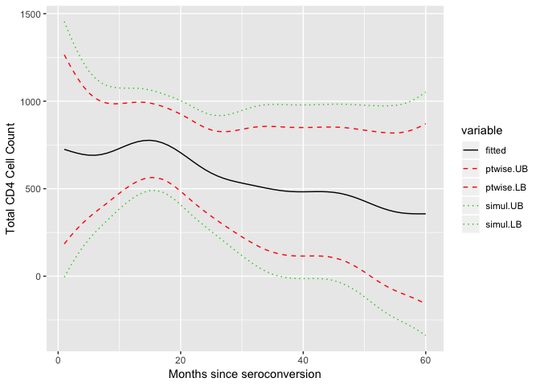
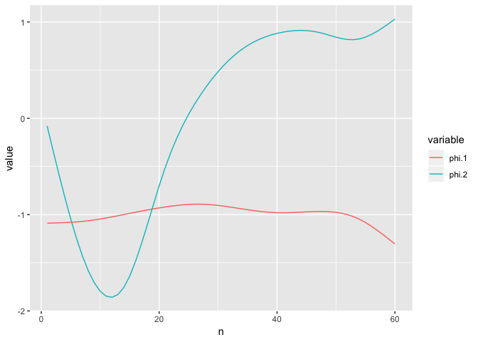
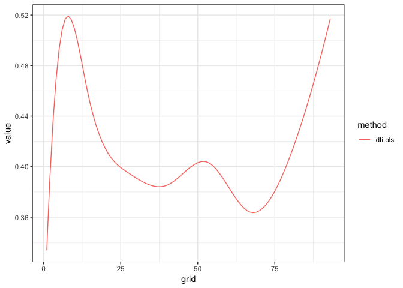
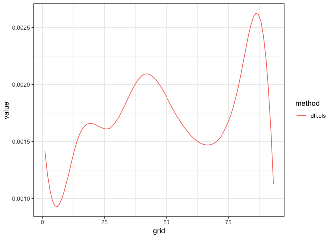

Function Documentation
================
Sara Kim

fpca.tfd()
----------

**Functional principal components analysis by smoothed covariance**

### Description

(Reference: refund::fpca.sc() <https://github.com/refunders/refund/blob/master/R/fpca.sc.R>)

Takes in a data frame containing a tfd class column (specified in the argument col input) and transforms it into a matrix class.

Decomposes functional observations using functional principal components analysis. A mixed model framework is used to estimate scores and obtain variance estimates.

### Usage

fpca.tfd(data = NULL, col = NULL, Y.pred = NULL, argvals = NULL, random.int = FALSE, nbasis = 10, pve = 0.99, npc = NULL, var = FALSE, simul = FALSE, sim.alpha = 0.95, useSymm = FALSE, makePD = FALSE, center = TRUE, cov.est.method = 2, integration ="trapezoidal")

### Arguments

@param data: the user must supply data frame containing a tfd class column.

@param col: a class tfd\_irreg variable in the specified data frame.

*BELOW IN PROGRESS*

**Arg must be changed since the current function does not take a matrix(Y) as an input **

**I think Y.pred is not needed or we can also add Y as an arg and take tfd matrix as an input**

@param Y.pred: if desired, a matrix of functions to be approximated using the FPC decomposition. argvals: the argument values of the function evaluations in Y, defaults to a equidistant grid from 0 to 1. random.int
If TRUE, the mean is estimated by gamm4 with random intercepts. If FALSE (the default), the mean is estimated by gam treating all the data as independent. nbasis
number of B-spline basis functions used for estimation of the mean function and bivariate smoothing of the covariance surface. pve proportion of variance explained: used to choose the number of principal components. npc prespecified value for the number of principal components (if given, this overrides pve). var TRUE or FALSE indicating whether model-based estimates for the variance of FPCA expansions should be computed. simul
logical: should critical values be estimated for simultaneous confidence intervals? sim.alpha
1 - coverage probability of the simultaneous intervals. useSymm logical, indicating whether to smooth only the upper triangular part of the naive covariance (when cov.est.method==2). This can save computation time for large data sets, and allows for covariance surfaces that are very peaked on the diagonal. makePD
logical: should positive definiteness be enforced for the covariance surface estimate? center
logical: should an estimated mean function be subtracted from Y? Set to FALSE if you have already demeaned the data using your favorite mean function estimate. cov.est.method
covariance estimation method. If set to 1, a one-step method that applies a bivariate smooth to the y(s\_1)y(s\_2) values. This can be very slow. If set to 2 (the default), a two-step method that obtains a naive covariance estimate which is then smoothed. integration quadrature method for numerical integration; only 'trapezoidal' is currently supported.

### examples

``` r
library(ggplot2)
library(reshape2)
```

    ## 
    ## Attaching package: 'reshape2'

    ## The following object is masked from 'package:tidyr':
    ## 
    ##     smiths

``` r
data(cd4)
```

We will work with the same cd4 matrix, containing one functional observation in each row, used in the Refund package.

``` r
cd4_tfd = cd4 %>%
  tfd()
cd4_df = data_frame(cd4_tfd)

head(cd4_df)
```

    ## # A tibble: 6 x 1
    ##   cd4_tfd                                   
    ##   <S3: tfd_irreg>                           
    ## 1 [1]: ( -9, 548);( -3, 893);(  3, 657)     
    ## 2 [2]: ( -3, 752);(  3, 459);(  9, 181); ...
    ## 3 [3]: (-15, 846);( -9,1102);( -3, 801); ...
    ## 4 [4]: (-17,1277);( -9,1132);( -3,1454); ...
    ## 5 [5]: ( -4, 994);(  4, 486);( 10, 605); ...
    ## 6 [6]: (-17,1119);(-10, 729);( 10, 355)

I altered the cd4 matrix to be in a tfd format. Then made it into a dataframe with only one column: cd4\_tfd.

``` r
source("./function/quadWeights.R")
source("./function/fpca.tfd.R")
```

``` r
fit.cd4 = fpca.tfd(data = cd4_df, col = cd4_tfd, var = TRUE, simul = TRUE)

fit.mu = data.frame(mu = fit.cd4$mu,
                    n = 1:ncol(fit.cd4$Yhat))
fit.basis = data.frame(phi = fit.cd4$efunctions, #the FPC basis functions.
                       n = 1:ncol(fit.cd4$Yhat))

## for one subject, examine curve estimate, pointwise and simultaneous itervals
ex = 1
ex.cd4 = data.frame(fitted = fit.cd4$Yhat[ex,],
           ptwise.UB = fit.cd4$Yhat[ex,] + 1.96 * sqrt(fit.cd4$diag.var[ex,]),
           ptwise.LB = fit.cd4$Yhat[ex,] - 1.96 * sqrt(fit.cd4$diag.var[ex,]),
           simul.UB = fit.cd4$Yhat[ex,] + fit.cd4$crit.val[ex] * sqrt(fit.cd4$diag.var[ex,]),
           simul.LB = fit.cd4$Yhat[ex,] - fit.cd4$crit.val[ex] * sqrt(fit.cd4$diag.var[ex,]),
           n = 1:ncol(fit.cd4$Yhat))

## plot data for one subject, with curve and interval estimates
ex.cd4.m = melt(ex.cd4, id = 'n')

## plot data for one subject, with curve and interval estimates
ex.cd4.m = melt(ex.cd4, id = 'n')
ggplot(ex.cd4.m, aes(x = n, y = value, group = variable, color = variable, linetype = variable)) +
  geom_path() +
  scale_linetype_manual(values = c(fitted = 1, ptwise.UB = 2,
                        ptwise.LB = 2, simul.UB = 3, simul.LB = 3)) +
  scale_color_manual(values = c(fitted = 1, ptwise.UB = 2,
                     ptwise.LB = 2, simul.UB = 3, simul.LB = 3)) +
  labs(x = 'Months since seroconversion', y = 'Total CD4 Cell Count')
```



``` r
## plot estimated mean function
ggplot(fit.mu, aes(x = n, y = mu)) + geom_path() 
```


``` r
## plot the first two estimated basis functions
fit.basis.m = melt(fit.basis, id = 'n')
ggplot(subset(fit.basis.m, variable %in% c('phi.1', 'phi.2')), aes(x = n,
y = value, group = variable, color = variable)) + geom_path()
```



ols\_cs\_tfd()
--------------

**Cross-sectional FoSR using GLS**

### Description

(reference: <https://github.com/refunders/refund/blob/master/R/OLS_CS.R>)

Assuming that the response of the proposed model is a tfd class variable, it calls the response variable and alters it to be a matrix.

Fitting function for function-on-scalar regression for cross-sectional data. This function estimates model parameters using GLS: first, an OLS estimate of spline coefficients is estimated; second, the residual covariance is estimated using an FPC decomposition of the OLS residual curves; finally, a GLS estimate of spline coefficients is estimated. Although this is in the 'BayesFoSR' package, there is nothing Bayesian about this FoSR.

### Usage

ols\_cs\_tfd(formula, data=NULL, Kt=5, basis = "bs", verbose = TRUE)

### Arguments

@param formula: a formula indicating the structure of the proposed model. Takes in tfd class variable as the response.

@param data: an optional data frame, list or environment containing the variables in the model. If not found in data, the variables are taken from environment(formula), typically the environment from which the function is called.

@param Kt: number of spline basis functions used to estimate coefficient functions

@param basis: basis type; options are "bs" for b-splines and "pbs" for periodic b-splines

@param verbose: logical defaulting to TRUE – should updates on progress be printed?

### Examples

Reading in DTI (`refund::DTI`) and dti, a data frame derived from DTI with two columns containing functional data (cca, rcst) in tfd class instead of matrices.

``` r
DTI = refund::DTI

dti = with(refund::DTI, 
  data.frame(id = ID, sex = sex, 
             pasat = pasat,
    case = factor(ifelse(case, "MS", "control")))) %>% as.tbl %>% 
        mutate(cca = tfd(DTI$cca, seq(0,1, l = 93), signif = 2) %>%
                     tfd(arg = seq(0,1,l = 93)),
               rcst = tfd(DTI$rcst, seq(0, 1, l = 55), signif = 3))
```

``` r
source("./function/ols_cs_tfd.R")
```

``` r
dti.ols = ols_cs_tfd(cca ~ pasat, data = dti, Kt = 10)
```

    ## Using OLS to estimate model parameters

``` r
models = c("dti.ols")
intercepts = sapply(models, function(u) get(u)$beta.hat[1,])
slopes = sapply(models, function(u) get(u)$beta.hat[2,])

# plotting estimated intercepts
plot.dat = melt(intercepts); colnames(plot.dat) = c("grid", "method", "value")
ggplot(plot.dat, aes(x = grid, y = value, group = method, color = method)) + 
   geom_path() + theme_bw()
```



``` r
# plotting estimated slopes
plot.dat = melt(slopes); colnames(plot.dat) = c("grid", "method", "value")
ggplot(plot.dat, aes(x = grid, y = value, group = method, color = method)) + 
   geom_path() + theme_bw()
```


