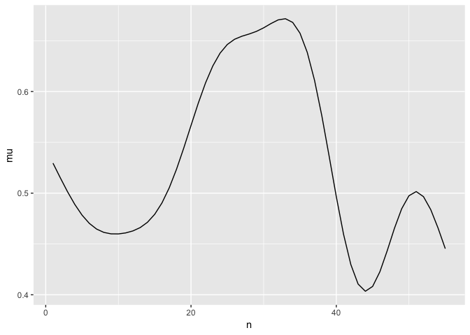
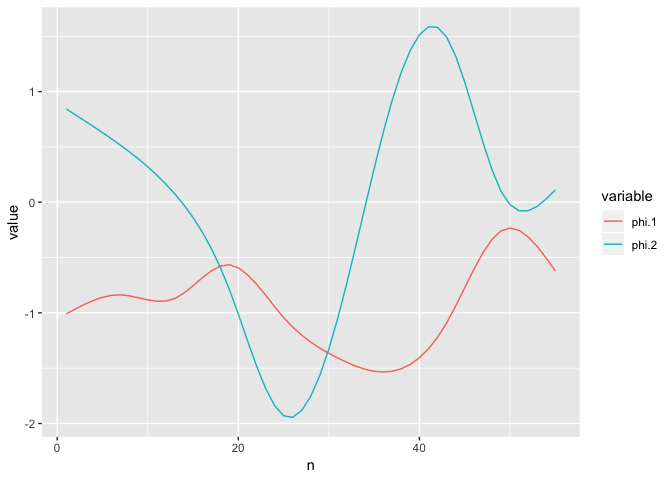
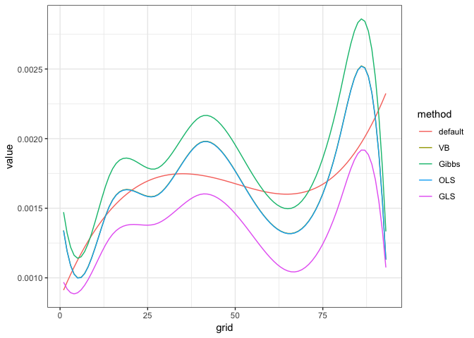
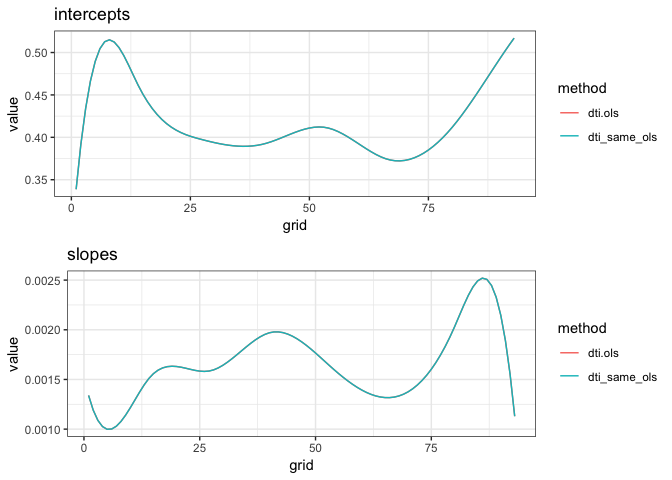

explore tidyfun
================
Gaeun Kim
1/4/2019

First, let's read in our tf datasets.

``` r
temp_tfd = load("../data/temp_tfd.RData")
handw_tfd= load("../data/handw_tfd.RData")

DTI = refund::DTI

dti = with(refund::DTI, 
  data.frame(id = ID, sex = sex, 
    case = factor(ifelse(case, "MS", "control")))) %>% as.tbl %>% 
        mutate(cca = tfd(DTI$cca, seq(0,1, l = 93), signif = 2) %>%
                     tfd(arg = seq(0,1,l = 93)),
               rcst = tfd(DTI$rcst, seq(0, 1, l = 55), signif = 3))
```

fpca.tfd function examples

``` r
fit.cca = fpca.tfd(data = dti, col = rcst)

fit.mu = data.frame(mu = fit.cca$mu,
                    n = 1:ncol(fit.cca$Yhat))
fit.basis = data.frame(phi = fit.cca$efunctions, #the FPC basis functions.
                       n = 1:ncol(fit.cca$Yhat))

## plot estimated mean function
ggplot(fit.mu, aes(x = n, y = mu)) + geom_path() 
```



``` r
## plot the first two estimated basis functions
fit.basis.m = melt(fit.basis, id = 'n')
ggplot(subset(fit.basis.m, variable %in% c('phi.1', 'phi.2')), aes(x = n,
y = value, group = variable, color = variable)) + geom_path()
```



putting cd4 dataset to fpca.tfd function

``` r
data(cd4)
# CD4 cell counts for 366 subjects between months -18 and 42 since seroconversion. Each subject's observations are contained in a single row.
# subject * weeks

cd4_tfd = cd4 %>%
  tfd()
cd4_df = data_frame(cd4_tfd, id = 1:366) %>%
  select(cd4 = cd4_tfd, everything())

fit.cd4 = cd4_df %>%
  fpca.tfd(data =., col = cd4)

fit.mu = data.frame(mu = fit.cd4$mu,
                    n = 1:ncol(fit.cd4$Yhat))
fit.basis = data.frame(phi = fit.cd4$efunctions, #the FPC basis functions.
                       n = 1:ncol(fit.cd4$Yhat))

## plot estimated mean function
ggplot(fit.mu, aes(x = n, y = mu)) + geom_path() 
```


cd4 example on the refund page

``` r
Fit.MM = fpca.sc(cd4, var = TRUE, simul = TRUE)

Fit.mu = data.frame(mu = Fit.MM$mu,
                    d = as.numeric(colnames(cd4)))
Fit.basis = data.frame(phi = Fit.MM$efunctions, # d × npc matrix of estimated eigenfunctions of the functional covariance, i.e., the FPC basis functions.
                       d = as.numeric(colnames(cd4)))

## for one subject, examine curve estimate, pointwise and simultaneous itervals
EX = 1
EX.MM = data.frame(fitted = Fit.MM$Yhat[EX,],
           ptwise.UB = Fit.MM$Yhat[EX,] + 1.96 * sqrt(Fit.MM$diag.var[EX,]),
           ptwise.LB = Fit.MM$Yhat[EX,] - 1.96 * sqrt(Fit.MM$diag.var[EX,]),
           simul.UB = Fit.MM$Yhat[EX,] + Fit.MM$crit.val[EX] * sqrt(Fit.MM$diag.var[EX,]),
           simul.LB = Fit.MM$Yhat[EX,] - Fit.MM$crit.val[EX] * sqrt(Fit.MM$diag.var[EX,]),
           d = as.numeric(colnames(cd4)))

## plot data for one subject, with curve and interval estimates
EX.MM.m = melt(EX.MM, id = 'd')
ggplot(EX.MM.m, aes(x = d, y = value, group = variable, color = variable, linetype = variable)) +
  geom_path() +
  scale_linetype_manual(values = c(fitted = 1, ptwise.UB = 2,
                        ptwise.LB = 2, simul.UB = 3, simul.LB = 3)) +
  scale_color_manual(values = c(fitted = 1, ptwise.UB = 2,
                     ptwise.LB = 2, simul.UB = 3, simul.LB = 3)) +
  labs(x = 'Months since seroconversion', y = 'Total CD4 Cell Count')
```


``` r
## plot estimated mean function
ggplot(Fit.mu, aes(x = d, y = mu)) + geom_path() +
  labs(x = 'Months since seroconversion', y = 'Total CD4 Cell Count')
```


``` r
## plot the first two estimated basis functions
Fit.basis.m = melt(Fit.basis, id = 'd')
ggplot(subset(Fit.basis.m, variable %in% c('phi.1', 'phi.2')), aes(x = d,
y = value, group = variable, color = variable)) + geom_path()
```

 looks same as the tfd version!

bayes\_fosr: "Wrapper function that implements several approaches to Bayesian function on scalar regression."

Exammple code from refund

-   I am getting errors regarding gibbs so I removed it from the sample for now.
-   error message: Error in tx\[, ind.cur\] %\*% siginv : non-conformable arguments

I won't alter DTI like they did in refund because I want it to be same as dti, a tdf format of DTI.

``` r
##### Cross-sectional real-data examples #####

## organize data
data(DTI)
#DTI = subset(DTI, select = c(cca, case, pasat))
#DTI = DTI[complete.cases(DTI),]
#DTI$gender = factor(sample(c("male","female"), dim(DTI)[1], replace = TRUE))
#DTI$status = factor(sample(c("RRMS", "SPMS", "PPMS"), dim(DTI)[1], replace = TRUE))

## fit models
default = bayes_fosr(cca ~ pasat, data = DTI)
```

    ## Beginning Algorithm 
    ## .........

``` r
VB = bayes_fosr(cca ~ pasat, data = DTI, Kp = 4, Kt = 10)
```

    ## Beginning Algorithm 
    ## .........

``` r
#Gibbs = bayes_fosr(cca ~ pasat, data = DTI, Kt = 10, est.method = "Gibbs", cov.method = #"Wishart", N.iter = 500, N.burn = 200)
OLS = bayes_fosr(cca ~ pasat, data = DTI, Kt = 10, est.method = "OLS")
```

    ## Using OLS to estimate model parameters

``` r
GLS = bayes_fosr(cca ~ pasat, data = DTI, Kt = 10, est.method = "GLS")
```

    ## Using OLS to estimate residual covariance 
    ## GLS

``` r
## plot results
models = c("default", "VB", "OLS", "GLS")
intercepts = sapply(models, function(u) get(u)$beta.hat[1,])
slopes = sapply(models, function(u) get(u)$beta.hat[2,])

plot.dat = melt(intercepts); colnames(plot.dat) = c("grid", "method", "value")
ggplot(plot.dat, aes(x = grid, y = value, group = method, color = method)) + 
   geom_path() + theme_bw()
```


``` r
plot.dat = melt(slopes); colnames(plot.dat) = c("grid", "method", "value")
ggplot(plot.dat, aes(x = grid, y = value, group = method, color = method)) + 
   geom_path() + theme_bw()
```



``` r
#Gibbs - Error in tx[, ind.cur] %*% siginv : non-conformable arguments
# removed Gibbs
```

ols\_cs: "Fitting function for function-on-scalar regression for cross-sectional data."

``` r
dti.ols = ols_cs(cca ~ pasat, data = DTI, Kt = 10)
```

    ## Using OLS to estimate model parameters

Below is a ols function for cross-sectional tfd datasets.

``` r
source("../function/ols_cs_tfd.R")
```

I will put in our tf dataset that we made in the beginning, dti.

``` r
dti["pasat"] = DTI$pasat

dti.ols.prac = ols_cs_tfd(cca ~ pasat, col = cca, data = dti, Kt = 10)
```

    ## Using OLS to estimate model parameters

``` r
models = c("dti.ols", "dti.ols.prac")
intercepts = sapply(models, function(u) get(u)$beta.hat[1,])
slopes = sapply(models, function(u) get(u)$beta.hat[2,])

plot.dat = melt(intercepts); colnames(plot.dat) = c("grid", "method", "value")
ggplot(plot.dat, aes(x = grid, y = value, group = method, color = method)) + 
   geom_path() + theme_bw()
```


``` r
plot.dat = melt(slopes); colnames(plot.dat) = c("grid", "method", "value")
ggplot(plot.dat, aes(x = grid, y = value, group = method, color = method)) + 
   geom_path() + theme_bw()
```


**Issue**

the dataset altered inside ols\_cs\_tfd seems to be same as DTI but it's giving slightly different results as we can see in the graph above.

checking if the datasets(altered dti and original DTI) are the same:

``` r
all(dti %>%
      pull(cca) %>%
      as.data.frame() %>%
      spread(key = arg, value = value) %>%
      select(-id) %>%
      as.matrix() == DTI$cca, na.rm = TRUE)
```

    ## [1] TRUE

``` r
all(dti$pasat == DTI$pasat, na.rm = TRUE)
```

    ## [1] TRUE

So the cca from dti altered to a matrix in the function is the same as cca in DTI as well as pasat in dti and in DTI. They also have equal dim size.

``` r
plot_fit_models = function(models) {
  
  models = models
  intercepts = sapply(models, function(u) get(u)$beta.hat[1,])
  slopes = sapply(models, function(u) get(u)$beta.hat[2,])

  plot.dat = melt(intercepts); colnames(plot.dat) = c("grid", "method", "value")
  p1 = ggplot(plot.dat, aes(x = grid, y = value, group = method, color = method)) + 
   geom_path() + theme_bw() + ggtitle("intercepts")

  plot.dat = melt(slopes); colnames(plot.dat) = c("grid", "method", "value")
  p2 = ggplot(plot.dat, aes(x = grid, y = value, group = method, color = method)) + 
   geom_path() + theme_bw() + ggtitle("slopes")
  
 gridExtra::grid.arrange(p1,p2)
}
```

Just to make sure if cca is the cause of the difference I will put DTI's cca inside dti.

``` r
dti_same = dti
dti_same["cca"] = DTI["cca"]

dti_same_ols = ols_cs(cca ~ pasat, data = dti_same, Kt = 10)
```

    ## Using OLS to estimate model parameters

``` r
models = c("dti.ols", "dti_same_ols")
plot_fit_models(models)
```



So, cca is the cause of the difference.

Let's see what we get if we change tdf dti to the original version and fit to cs.ols function.

``` r
dti_testing = dti
dti_testing["cca"] = dti$cca %>% 
  as.data.frame() %>%
  spread(key = arg, value = value) %>%
  select(-id) %>%
  as.matrix() 

dti.testing.ols = ols_cs(cca ~ pasat, data = dti_testing, Kt = 10)
```

    ## Using OLS to estimate model parameters

``` r
dti_cca = dti_testing$cca %>% as.data.frame()
DTI_cca = DTI$cca %>% as.data.frame()
rownames(dti_cca) = rownames(DTI_cca)
colnames(dti_cca) = colnames(DTI_cca)

dti_cca %>% is.na() %>% sum() #0 
```

    ## [1] 0

``` r
DTI_cca %>% is.na() %>% sum() #36
```

    ## [1] 36

So I see that while both cca columns have the sme values for non-missing data, cca at dti have no missing values while DTI has 36 missings.

-   Question: does tfd function remove missings?

``` r
which(is.na(DTI_cca), arr.ind=TRUE)
```

    ##        row col
    ## 2083_4 321  45
    ## 2083_4 321  46
    ## 2083_4 321  49
    ## 2083_4 321  50
    ## 2083_4 321  56
    ## 2083_4 321  57
    ## 2083_4 321  58
    ## 2083_4 321  59
    ## 2083_4 321  60
    ## 2083_4 321  61
    ## 2083_4 321  62
    ## 2083_4 321  63
    ## 2083_4 321  64
    ## 2017_2 126  65
    ## 2083_4 321  65
    ## 2017_2 126  66
    ## 2017_6 130  66
    ## 2017_7 131  66
    ## 2083_4 321  66
    ## 2017_1 125  67
    ## 2017_2 126  67
    ## 2017_6 130  67
    ## 2017_7 131  67
    ## 2083_4 321  67
    ## 2017_1 125  68
    ## 2017_2 126  68
    ## 2017_6 130  68
    ## 2083_2 319  68
    ## 2083_4 321  68
    ## 2083_2 319  69
    ## 2083_4 321  69
    ## 2083_2 319  70
    ## 2083_2 319  71
    ## 2083_4 321  71
    ## 2083_2 319  72
    ## 2083_4 321  72

``` r
dti_cca[321, 45]
```

    ## [1] 0.2825337

``` r
DTI_cca[321, 45]
```

    ## [1] NaN

Looking at one of the missings in DTI, I think the tfd function impute/approximate the missings.

gibbs\_cs\_fpca: "Cross-sectional FoSR using a Gibbs sampler and FPCA"

``` r
#gibbs_cs_fpca(cca ~ pasat, data = DTI, Kt = 10)
#gibbs_cs_fpca_prac(cca ~ pasat, data = DTI, Kt = 10)

#keeps on running...
```
